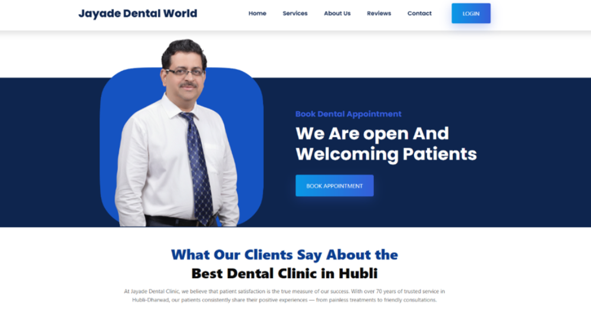
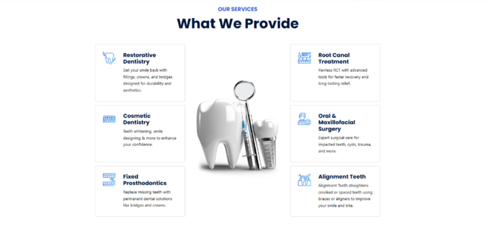
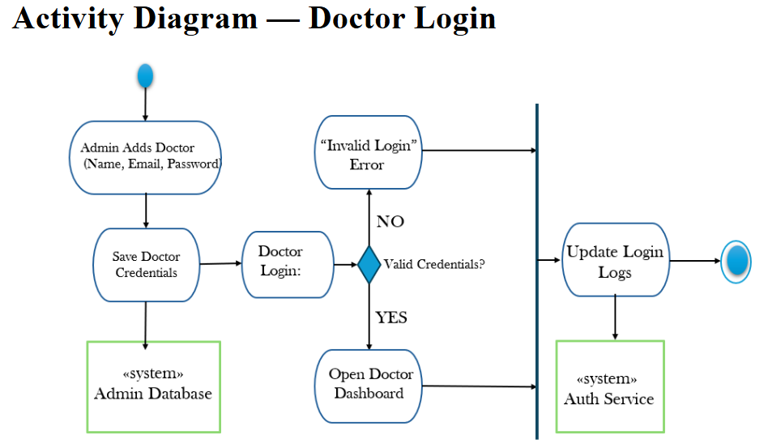
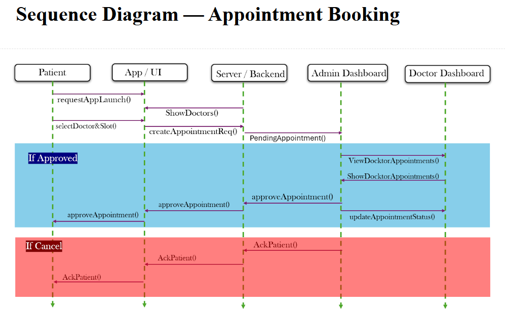
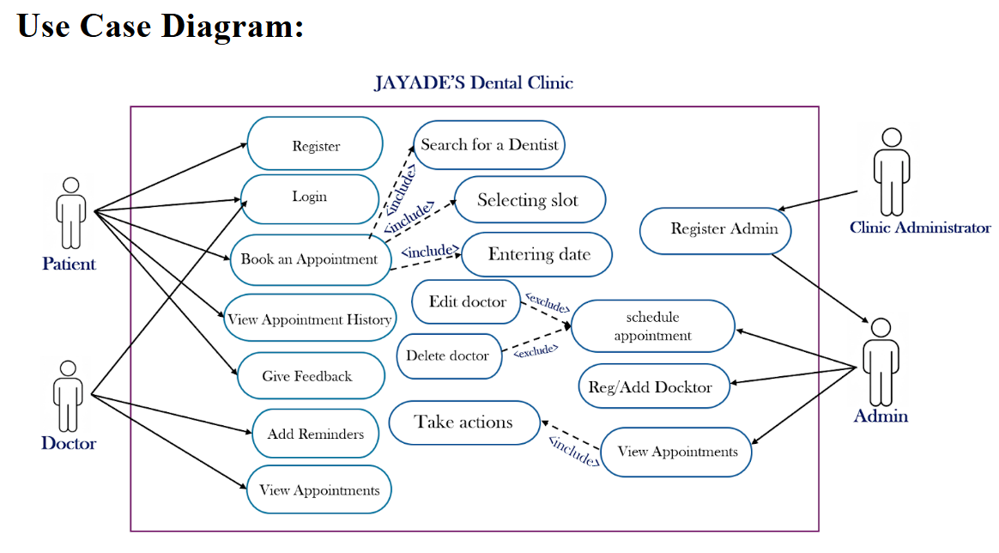

<div align="center">
  
  <br />
  <br />
  <h2 align="center">JAYADES Dental Clinic - Official Website</h2>
  The official website for JAYADES Dental Clinic. <br />Fully responsive and optimized for all devices, built using HTML, CSS, and JavaScript.
  <p><strong>🚧 Note: This website is currently a Work in Progress (WIP). 🚧</strong></p>
</div>

<br />

---

## 📸 Frontend Screenshots

<div align="center">
  
  <br /><br />
  
</div>

---

## 📊 UML Diagrams


<div align="center">
  
</div>


<div align="center">
  
</div>


<div align="center">
  
</div>

---

### Prerequisites
Before you begin, ensure you have met the following requirements:
* [Git](https://git-scm.com/downloads "Download Git") must be installed on your operating system.

### Run Locally
To run the **JAYADES Dental Clinic** website locally, run this command on your terminal/git bash:

Linux and macOS:
```bash
sudo git clone https://github.com/UmmidSalma/Software_Engineering_Project.git
```

Windows:
```bash
git clone https://github.com/UmmidSalma/Software_Engineering_Project.git
```

*(Note: Replace the GitHub URL with the actual repository URL once it is fully published)*

### Status
This project is currently **in development**. Features and designs are actively being added and refined to better serve the patients of JAYADES Dental Clinic.

### Contact
For inquiries regarding the clinic or the website, please feel free to reach out.

### License
This project is currently private and under development.
